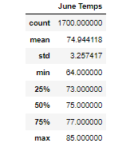
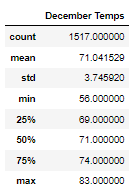

# Surfs_Up_Analysis
## Overview
The purpose of this project was to analyze temperature data for the months of June and December in Oahu, in order to determine if the surf and ice cream shop business is sustainable year-round

---

## Results

1. June has an average temperature of 74.94.

2. December has an average temperature of 71.04.

3. The biggest difference between June and December is the minimum temperature.

---

## Summary
Based on the results, I'd say an ice cream shop would be a great year-round business venture. Two additional queries I'd make in hopes of strengthening this assumptions are:
1. Average preciptation during June, and 
2. Average precipitation during December.
